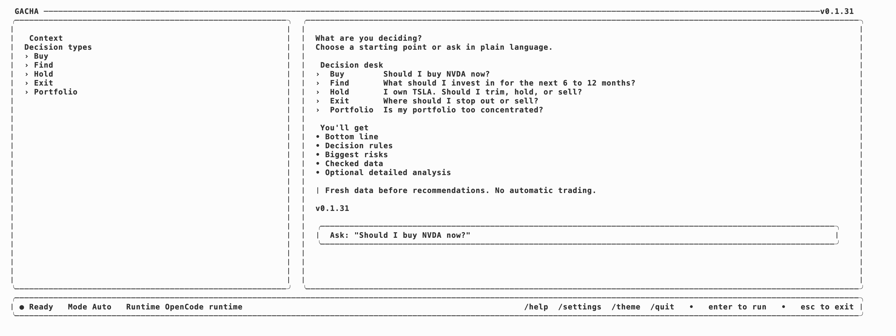

# gacha

로컬 AI 런타임으로 투자 질문을 더 엄격하게 조사하세요.

`gacha`는 터미널에서 실행되는 투자 리서치 앱입니다. 내부 AI 런타임으로 OpenCode를 사용하므로, 사용자는 매번 플랫폼을 고르지 않고 ChatGPT, GitHub Copilot, Gemini, OpenAI API 또는 다른 지원 provider를 연결해 사용할 수 있습니다.

런타임이 없으면 macOS와 Linux에서는 첫 실행 시 `gacha`가 설치를 도와줍니다. Windows에서는 OpenCode를 별도로 설치해야 합니다. 런타임을 사용할 수 없는 경우에도 ChatGPT, Claude, Gemini 같은 웹 AI에 붙여넣을 수 있는 프롬프트를 만들어 줍니다.

English: [../../README.md](../../README.md)

## 설치

### macOS와 Linux

```bash
curl -fsSL https://raw.githubusercontent.com/dkstm95/gacha/main/install.sh | sh
```

macOS/Linux 설치 스크립트를 실행하면 기본 명령어와 짧은 별칭이 생깁니다.

- `gacha`
- `gch`

평소에는 짧은 `gch`를 쓰면 됩니다. 전체 이름이 필요할 때는 `gacha`를 쓰면 됩니다.

`gacha` 자체를 사용하기 위해 Node, npm, Python, Go를 따로 설치할 필요는 없습니다.

설치 스크립트는 내려받은 릴리스 압축 파일을 게시된 SHA-256 체크섬과 대조한 뒤 설치합니다.

macOS와 Linux에서는 첫 실행 시 OpenCode runtime 설치와 AI provider 연결을 물어볼 수 있습니다. 이 runtime은 Gacha UI 뒤에서 AI를 실행하는 역할을 합니다.

설치 중 `export PATH=...` 문구가 나오면 터미널에 한 번 실행하세요.

### Windows

최신 릴리스에서 `gacha-windows-amd64.zip`을 내려받으세요.

```text
https://github.com/dkstm95/gacha/releases/latest
```

압축을 풀고 `gacha.exe`를 `PATH`에 포함된 폴더로 옮긴 뒤, 새 PowerShell 또는 Windows Terminal 창을 열어 확인합니다.

```powershell
gacha version
gacha setup
```

짧은 `gch` 명령도 원한다면 같은 폴더에서 `gacha.exe`를 `gch.exe`로 복사하세요.

```powershell
Copy-Item gacha.exe gch.exe
```

Windows에서는 OpenCode 자동 설치를 아직 지원하지 않습니다. OpenCode의 Windows 문서에 따라 별도로 설치하고, `opencode`가 `PATH`에서 실행되는지 확인한 뒤 `gacha setup`으로 provider를 연결하세요.

## 시작하기

```bash
gch
```

좌측 context rail, 우측 리서치 영역, 얇은 전역 하단 상태바가 있는 터미널 workspace가 열립니다.



우측 프롬프트에 질문을 입력하면 됩니다.

```text
예: "NVDA 지금 사도 될까?"
```

사용자가 모델이나 AI 플랫폼을 고를 필요는 없습니다. `gacha`가 OpenCode를 통해 내부적으로 라우팅합니다. 넓은 터미널에서는 좌측 rail이 맥락과 결정 유형에 집중하고 프롬프트는 우측 workspace 안에 머뭅니다. 작은 터미널에서는 workspace와 입력창 중심으로 접힙니다.

## 질문 예시

```text
예: 6개월에서 12개월 관점에서 무엇에 투자하면 좋을까?
예: AI 인프라에 투자하고 싶은데 어떤 종목이나 ETF를 비교해야 할까?
예: TSLA를 보유 중인데 언제 줄이거나 팔아야 할까?
예: 내 포트폴리오를 점검해줘: AAPL 35%, NVDA 30%, SGOV 35%
```

앱을 열지 않고 한 번만 질문할 수도 있습니다.

```bash
gch "NVDA 지금 사도 될까?"
```

## 설정 확인

로컬 AI runtime 준비 상태를 확인하려면 다음을 실행하세요.

```bash
gch doctor
```

이 명령은 전체 준비 상태, 연결된 provider 상태, Gacha가 OpenCode에 요청할 모델, 리포트 저장 위치를 보여줍니다. 기본 모델 모드는 `auto`입니다.

앱 안에서 설정을 보려면 다음을 입력하세요.

```text
/settings
```

앱 안에서 모델 모드, 언어, 테마를 설정할 수 있습니다.

```text
/model
/model auto
/model opencode-default
/model provider/model
/language
/language auto
/language en
/language ko
/theme
/theme system
/theme dark
/theme light
/theme gacha
```

`/model`, `/language`, `/theme`은 앱 안에서 선택 화면을 엽니다. ↑/↓로 이동하고 enter로 선택하거나, 전체 명령을 직접 입력할 수 있습니다. `system`은 터미널 배경에 맞춰 적응하고, `dark`, `light`, `gacha`는 고정 팔레트를 사용합니다.

런타임 설정, 진단, 업데이트는 앱 밖에서 실행합니다.

```bash
gch setup
gch doctor
gch update
```

스크립트나 터미널 명령으로도 설정할 수 있습니다.

```bash
gch config get
gch config set model auto
gch config set model opencode-default
gch config set model provider/model
gch config set language ko
gch config set theme system
```

auto 모드에서 Gacha는 연결된 provider의 현재 모델 목록을 OpenCode에 물어본 뒤, 그 목록 안에서 리서치에 적합한 모델을 고릅니다. OpenAI에서는 특정 모델명을 하드코딩하지 않고 `gpt-N` 또는 `gpt-N.M` 형태의 가장 최신 base frontier 모델을 우선합니다. `mini`, `nano`, `lite`, `flash`, `fast`, `spark`처럼 작고 빠른 변형과 코딩 특화 변형은 base frontier 모델보다 뒤로 보냅니다.

OpenAI OAuth, 즉 ChatGPT 구독 계정 경로에서는 `pro` 모델의 우선순위를 낮춥니다. OpenCode가 현재 ChatGPT 계정으로 실제 실행할 수 없는 모델까지 목록에 보여줄 수 있기 때문입니다. 그래도 선택된 모델이 ChatGPT 계정에서 지원되지 않는다고 거절되면 Gacha는 발견된 다음 후보로 재시도합니다.

모델 목록을 읽을 수 없으면 Gacha는 하드코딩된 모델을 추측하지 않습니다. `--model` 없이 OpenCode를 실행해서 OpenCode 기본값을 사용합니다.

고급 사용자는 다음처럼 직접 모델을 지정할 수 있습니다.

```bash
GACHA_OPENCODE_MODEL=provider/model gch
```

또는 `~/.config/gacha/config.json` 파일을 만들 수 있습니다.

```json
{
  "model": "auto",
  "language": "auto",
  "theme": "system"
}
```

모델 지원 값은 `auto`, `opencode-default`, 직접 지정한 `provider/model`입니다. 테마 지원 값은 `system`, `dark`, `light`, `gacha`입니다.

## 저장된 리포트

AI 런타임이 리포트 생성을 완료하면 `gacha`는 Markdown 파일로 저장할지 물어봅니다.

기본 위치:

```text
~/.local/share/gacha/reports
```

`XDG_DATA_HOME`이 설정되어 있으면 다음 위치에 저장합니다.

```text
$XDG_DATA_HOME/gacha/reports
```

사용자가 저장에 동의한 경우에만 저장합니다. 복사/붙여넣기용 프롬프트와 dry run 결과는 리포트로 저장하지 않습니다.

## 언어

`gacha`는 `GACHA_LANG`, `LANGUAGE`, `LC_ALL`, `LC_MESSAGES`, `LANG` 값을 보고 터미널 언어를 감지합니다.

언어가 한국어이면 인터랙티브 UI를 한국어로 표시합니다. 리포트도 감지된 언어로 작성하도록 AI에 요청합니다. 질문에 한국어가 포함되어 있으면 터미널 locale이 영어여도 한국어 답변을 요청합니다.

터미널 언어와 별도로 고정하려면 `~/.config/gacha/config.json`의 `"language"` 값을 `auto`, `en`, `ko` 중 하나로 설정하세요. `GACHA_LANG` 환경변수가 있으면 그 값이 우선합니다.

`gacha`는 다음 경로를 사용합니다.

```text
OpenCode runtime -> 복사/붙여넣기 프롬프트
```

OpenCode가 없거나 연결된 provider가 없다면 다음 명령을 실행하세요.

```bash
gch setup
```

`gch setup`은 필요한 경우 runtime을 설치한 뒤 provider login을 시작합니다. ChatGPT, GitHub Copilot, Gemini, OpenAI API 또는 OpenCode가 지원하는 다른 provider를 연결할 수 있습니다.

Windows에서는 `gch setup`이 OpenCode를 자동 설치하지 않습니다. OpenCode를 별도로 설치하고 `opencode`가 `PATH`에서 실행되는지 확인한 뒤 `gacha setup` 또는 `gch setup`을 실행하세요.

인터랙티브 홈 화면도 OpenCode 또는 provider 로그인이 없으면 설정 안내를 보여줍니다. 설정 후 다시 `gch`로 돌아와 첫 투자 질문을 입력하세요.

설정 후 투자 리서치 흐름과 결과 표시는 계속 Gacha UI 안에서 처리됩니다.

runtime 실행에 실패하면 웹 AI에 붙여넣을 수 있는 프롬프트로 자동 전환합니다.

## 업데이트

```bash
gch update
```

macOS와 Linux에서는 현재 컴퓨터에 맞는 바이너리를 내려받고 게시된 SHA-256 체크섬으로 검증한 뒤 기존 파일을 교체합니다.

Windows에서는 실행 중인 `.exe` 교체 문제를 피하기 위해 self-update를 비활성화했습니다. 최신 `gacha-windows-amd64.zip` 또는 `gacha-windows-arm64.zip`을 내려받아 `PATH`에 있는 `gacha.exe`를 교체한 뒤 새 터미널을 여세요.

## 최신 데이터

투자 정보는 빠르게 바뀝니다. 사용자가 "최신"이라고 쓰지 않아도 `gacha`는 AI에게 현재 웹/시장 데이터를 확인하라고 지시합니다.

현재 데이터를 확인할 수 없으면 AI는 추천을 내리지 않아야 합니다.

좋은 답변은 짧고 쉬우며 1차 결정을 내릴 수 있는 기본 리포트로 시작합니다. 상세 분석은 그 판단을 검증하는 데 도움이 될 때만 포함합니다.

기본 리포트에는 다음이 포함되어야 합니다.

- 데이터 기준 시점
- 출처 링크
- 현재 가격 또는 최신 수치
- 쉬운 결론
- 단순한 실행 계획
- 시간 기준, 행동 조건, thesis 훼손 조건, 재검토 시점
- 가장 큰 리스크
- 필요 시 가장 강한 반대 의견
- 매수, 보유, 매도, 관망 조건
- 앞으로 볼 지표
- 상세 밸류에이션, 시나리오, 포트폴리오 적합성, 출처 단위 근거를 요청할 수 있다는 짧은 안내

## 한계

`gacha`는 다음을 하지 않습니다.

- 자동 매매
- 수익 보장
- 전문 금융, 세무, 법률 자문 대체
- 현재 버전에서 직접 시장 데이터 조회

`gacha`는 엄격한 리서치 흐름을 만들어 AI 도구에 전달합니다. 최신 웹/시장 데이터 조사는 연결된 AI 도구가 수행해야 합니다.

## 개발자 문서

개발 문서: [../development.md](../development.md)
